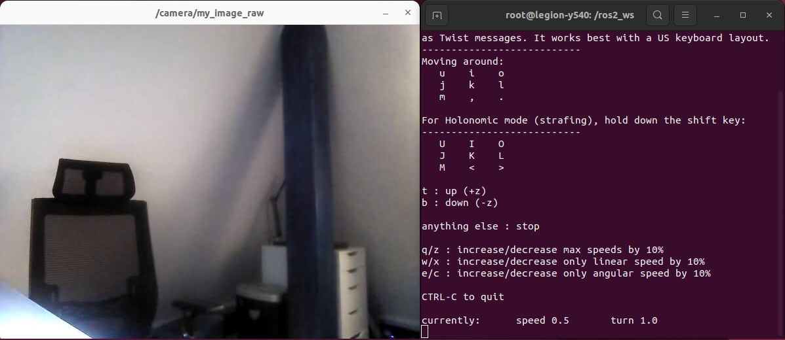

# rosbot-xl-telepresence

Manual ROSbot XL Driving over the Internet with Real-Time Camera Feed



## Step 1: Connecting ROSbot and laptop over VPN

Ensure that both ROSbot XL and you laptop are linked to the same Husarnet VPN network. If they are not follow these steps:

1. Setup a free account at [app.husarnet.com](https://app.husarnet.com/), create a new Husarnet network, click the **[Add element]** button and copy the code from the **Join Code** tab.
2. Connect your laptop to the [Husarnet network](https://husarnet.com/docs). If you are Ubuntu user, just run:

   ```bash
   curl https://install.husarnet.com/install.sh | sudo bash
   ```

   and connect to the Husarnet network with:

   ```bash
   sudo husarnet join <paste-join-code-here>
   ```

3. Connect your ROSbot to the Husarnet network. Husarnet is already pre-installed so just run:

   ```bash
   sudo husarnet join <paste-join-code-here> rosbotxl
   ```

   > note that `rosbotxl` is a Husarnet hostname that is hardcoded in the [compose.pc.yaml](/rosbot-telepresence/blob/main/compose.pc.yaml) file. If you want a different hostname for your ROSbot remember to change it.
 

## Step 2: Clonning the repo

This repository contains the Docker Compose setup for both PC and ROSbot. You can clone it to both PC and ROSbot, or use the `./sync_with_rosbot.sh` script to clone it to your PC and keep it synchronized with the robot

```bash
git clone https://github.com/husarion/rosbot-xl-telepresence
cd rosbot-xl-telepresence 
export ROSBOT_ADDR=rosbotxl # Replace with your own Husarnet hostname
./sync_with_rosbot.sh $ROSBOT_ADDR
```

## Step 3: Flashing the ROSbot Firmware

SSH to the ROSbot's shell:

```bash
ssh husarion@$ROSBOT_ADDR
```

and execute:

```bash
cd rosbot-xl-telepresence
./flash_rosbot_firmware.sh
```

## Step 4: Launching ROS 2 nodes

### On both PC and ROSbot

We need to make sure `MULTICASTING` is enabled on `lo` interface:

```bash
$ ip link show lo
1: lo: <LOOPBACK,MULTICAST,UP,LOWER_UP> mtu 65536 qdisc noqueue state UNKNOWN mode DEFAULT group default qlen 1000
    link/loopback 00:00:00:00:00:00 brd 00:00:00:00:00:00
```

If not ...

```bash
sudo ip link set lo multicast on
```

### PC

```bash
xhost +local:docker && \
docker compose -f compose.pc.yaml up -d
```

open a teleop interface - if you have ROS 2 installed on your laptop just run:

```bash
ros2 run teleop_twist_keyboard teleop_twist_keyboard
```

### ROSbot

```bash
docker compose up
```

## Step 5: Launching DDS Router

On both ROSbot XL and laptop execute:

```
docker run \
--detach \
--name ros2router \
--network host \
--restart unless-stopped \
-e WHITELIST_INTERFACES="172.22.0.1 127.0.0.1" \
-v $(pwd)/filter.yaml:/filter.yaml \
husarnet/ros2router:1.0.0
```

Note that we have added two addresses to the `WHITELIST_INTERFACES` env:

- `172.22.0.1` - is the network gateway address from the `172.22.0.0/24` internal network of the containers we launch from `compose.yaml` files
- `127.0.0.1` - is a local loopback interface on the host

You can stop the container with:

```
docker stop ros2router
```

And reenable it with:

```
docker start ros2router
```

## Troubleshooting

###  `Packet was not a Theora header` warning

The log from your computer where you launched `compose.pc.yaml` may contain the following message:

```
[image_republisher]: [theora] Packet was not a Theora header
```

Due to an issue in the theora codec, headers are sent only at the start. If you've initiated `compose.pc.yaml` following `compose.yaml`, it's essential to restart the `luxonis` service. This is old problem with a theora codec - see [GitHub Issue](https://github.com/ros-perception/image_transport_plugins/issues/4#issuecomment-15150432).

To do so, execute in the ROSbot's terminal in the `/home/husarion/rosbot-telepresence` folder the following line:

```bash
docker compose restart luxonis
```

## Usefull tips

**1. Checking a datarate**

To assess the data rate of a video stream being transmitted over the Husarnet VPN (which appears in your OS as the `hnet0` network interface), execute the following:

```bash
husarion@rosbot:~$ ifstat -i hnet0
      wlan0       
 KB/s in  KB/s out
    6.83   2744.66
    1.67   2659.88
    1.02   2748.40
    6.73   2565.20
    1.02   2748.65
    1.18   2749.64
```

**2. Sending uncompressed video frames over the network**

If raw image data is being transmitted over the network, you need to perform some [DDS-tunning](https://docs.ros.org/en/humble/How-To-Guides/DDS-tuning.html) (both on ROSbot and PC):

For configs in LAN:

```bash
sudo sysctl -w net.ipv4.ipfrag_time=3 # 3s
sudo sysctl -w net.ipv4.ipfrag_high_thresh=134217728 # (128 MB)
```

For configs over VPN:

```bash
sudo sysctl -w net.ipv6.ip6frag_time=3 # 3s
sudo sysctl -w net.ipv6.ip6frag_high_thresh=134217728 # (128 MB)
```

