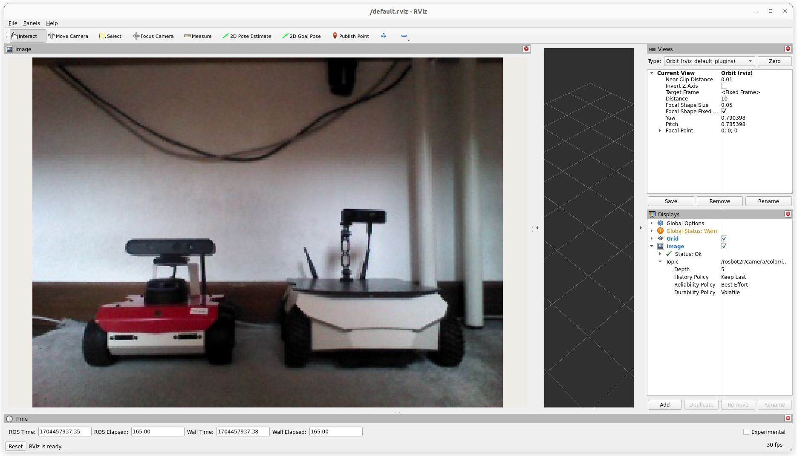

# rosbot-xl-telepresence

Manual control & transmitting a real-time video feed from the ROSbot XL to online web user interface powered by Foxglove. This setup functions across the Internet using Husarnet VPN.

> [!NOTE]
> There are two setups on two separate branches available
> | branch name | description |
> | - | - |
> | [**ros2router**](https://github.com/husarion/rosbot-xl-telepresence/tree/ros2router) | Running ROS 2 containers on ROSbot and on PC with the interface in RViz |
> | [**foxglove**](https://github.com/husarion/rosbot-xl-telepresence/tree/foxglove) | Running ROS 2 containers only on ROSbot with a web user interface powered by Foxglove |



## 🛍️ Necessary Hardware

For the execution of this project, the following components are required:

1. **[ROSbot XL](https://husarion.com/manuals/rosbot-xl/)** - with any SBC (RPi4, NUC or Jetson)
2. **[Luxonis Camera](https://husarion.com/tutorials/ros-equipment/oak-1-lite/)** - OAK-1 or OAK-D models.

These items are available for purchase as a complete kit at [our online store](https://store.husarion.com/collections/robots/products/rosbot-xl).

## Quick start

> [!NOTE]
> To simplify the execution of this project, we are utilizing [just](https://github.com/casey/just).
>
> Install it with:
>
> ```bash
> curl --proto '=https' --tlsv1.2 -sSf https://just.systems/install.sh | sudo bash -s -- --to /usr/bin
> ```

To see all available commands just run `just`:

```bash
husarion@rosbotxl:~/rosbot-xl-telepresence$ just
Available recipes:
    connect-husarnet joincode hostname # connect to Husarnet VPN network
    sync hostname="${ROBOT_HOSTNAME}" password="husarion" # Copy repo content to remote host with 'rsync' and watch for changes
    flash-firmware # flash the proper firmware for STM32 microcontroller in ROSbot XL
    start-rosbot   # start containers on a physical ROSbot XL
    run-teleop     # run teleop_twist_keybaord (host)
```

### 🌎 Step 1: Connecting ROSbot and Laptop over VPN

Ensure that both ROSbot XL and your laptop are linked to the same Husarnet VPN network. If they are not follow these steps:

1. Setup a free account at [app.husarnet.com](https://app.husarnet.com/), create a new Husarnet network, click the **[Add element]** button and copy the code from the **Join Code** tab.
2. Run in the linux terminal on your PC:
   ```bash
   cd rosbot-xl-telepresence/ # remember to run all "just" commands in the repo root folder
   export JOINCODE=<PASTE_YOUR_JOIN_CODE_HERE>
   just connect-husarnet $JOINCODE my-laptop
   ```
3. Run in the linux terminal of your ROSbot:
   ```bash
   export JOINCODE=<PASTE_YOUR_JOIN_CODE_HERE>
   sudo husarnet join $JOINCODE rosbotxl
   ```
> [!IMPORTANT]
> note that `rosbotxl` is a default ROSbot hostname used in this project. If you want to change it, edit the `.env` file and change the line:
> ```bash
> ROBOT_NAMESPACE=rosbotxl
> ```


### 📡 Step 2: Sync

If you have cloned this repo not on the robot but on your PC, you need to copy the local changes (on PC) to the remote ROSbot

```bash
just sync rosbotxl # or a different ROSbot hostname you used in Step 1 p.3
```

> you can skip this step if you have cloned this repo on the ROSbot directly

### 🔧 Step 3: Verifying User Configuration

To ensure proper user configuration, review the content of the `.env` file and select the appropriate configuration (the default options should be suitable).

- **`LIDAR_BAUDRATE`** - depend on mounted LiDAR,
- **`MECANUM`** - wheel type,
- **`ROBOT_HOSTNAME`** - type your ROSbot device name the same as in Husarnet.

> [!IMPORTANT]
> The value of the `ROBOT_HOSTNAME` parameter in the `.env` file should be the same as the Husarnet hostname for ROSbot XL.

### 🤖 Step 4: Launching

Execute in the ROSbot's shell:

   ```bash
   just start-rosbot
   # or just rosbot
   ```

### 🚗 Step 5: Control the ROSbot from teleop / gamepad

Open the **Google Chrome** browser on your laptop and navigate to:

<http://rosbotxl:8080/ui>
<!-- 
 -->

> [!IMPORTANT]
> Due to efficiency and official manufacturer support, it is recommended to use `foxglove-websocket`. When using `rosbridge-websocket`, it is necessary to edit `Custom Layers` to visualize the robot mesh.


## Useful tips and troubleshooting

### 1. Checking a datarate

To assess the data rate of a video stream being transmitted over the Husarnet VPN (which appears in your OS as the `hnet0` network interface), execute the following:

```bash
husarion@rosbot:~$ ifstat -i hnet0
      wlan0
 KB/s in  KB/s out
    6.83   2744.66
    1.67   2659.88
    1.02   2748.40
```
### 2. Insufficient permissions

Based on this [Depthai troubleshooting guide](https://github.com/luxonis/depthai-docs-website/blob/master/source/pages/troubleshooting.rst#udev-rules-on-linux)

If you see error from Luxonis camera like: `[depthai] [warning] Insufficient permissions to communicate with X_LINK_UNBOOTED device with name "1.3". Make sure udev rules are set`, run:

```bash
echo 'SUBSYSTEM=="usb", ATTRS{idVendor}=="03e7", MODE="0666"' | sudo tee /etc/udev/rules.d/80-movidius.rules
sudo udevadm control --reload-rules && sudo udevadm trigger
```